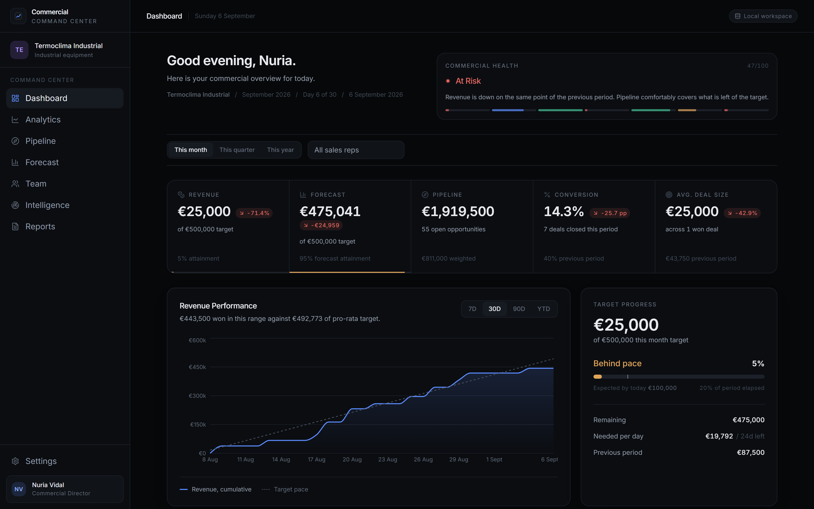
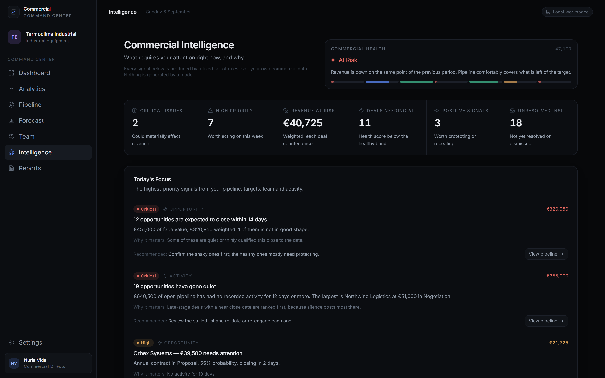
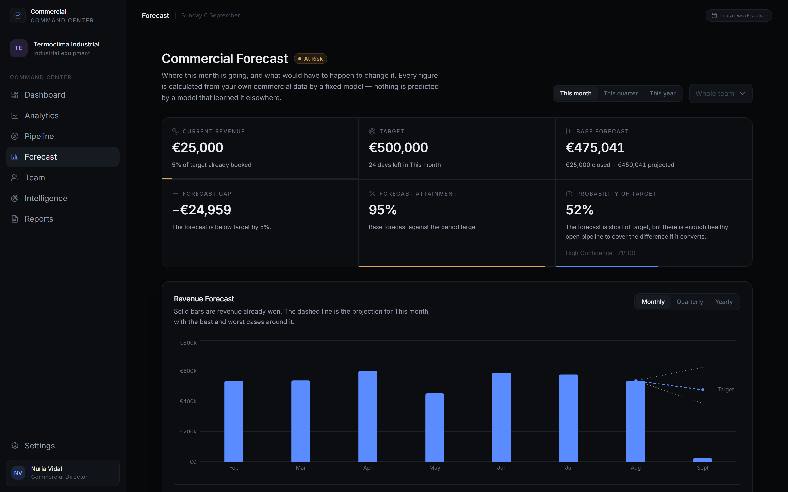
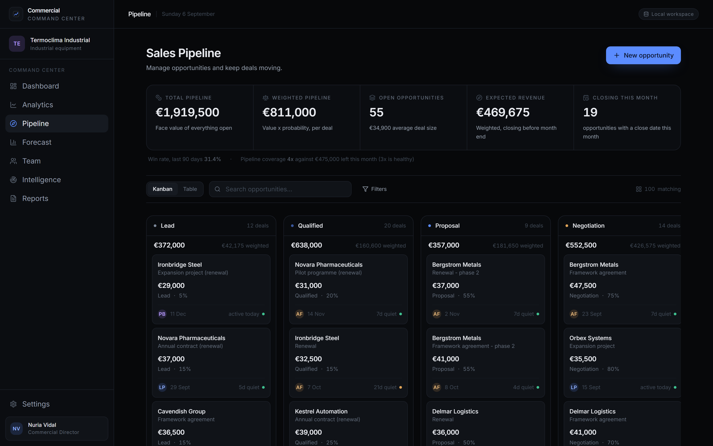
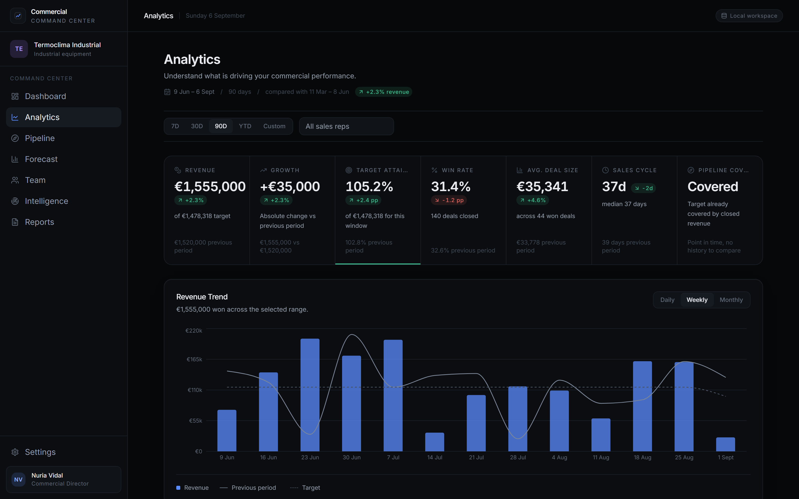
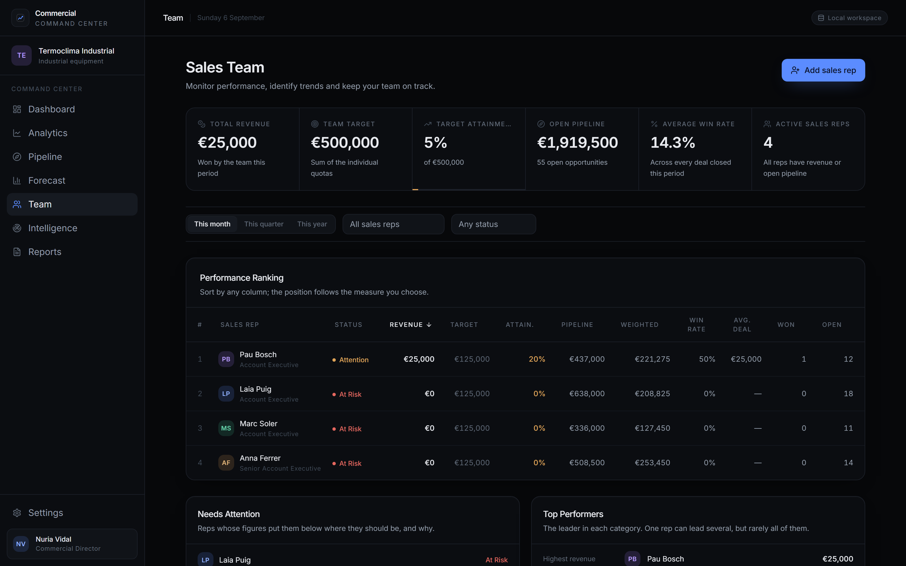
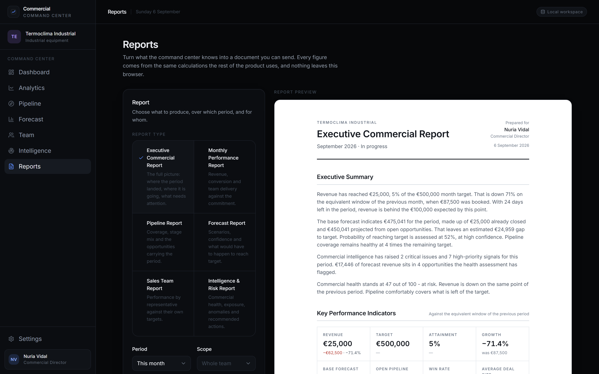
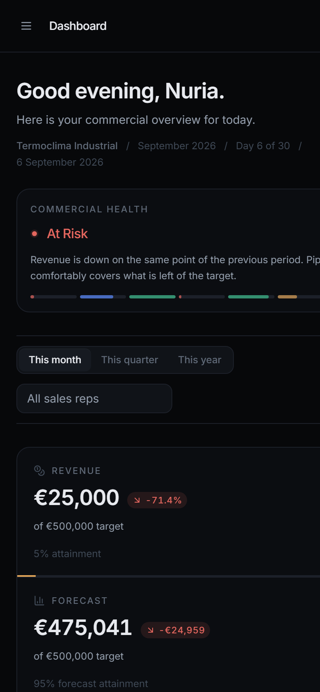
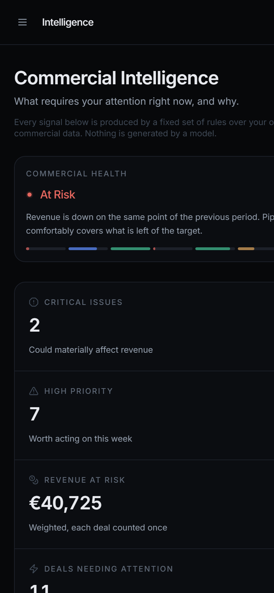

<div align="center">

<!--
  HERO BANNER
  Drop the animated banner here as docs/banner.gif and uncomment the line below.
  Nothing else in this README depends on it.
-->
<!--  -->

# Commercial Command Center

### See the business. Know what matters. Act before the month closes.

An executive control room for commercial directors — pipeline, forecast,
intelligence and board-ready reports, computed in the browser from one shared
source of truth.

<br />

[](https://react.dev)
[](https://www.typescriptlang.org)
[](https://vite.dev)
[](https://tailwindcss.com)
[](https://recharts.org)
[](./LICENSE)

**[Screens](#-the-command-center)** · **[How it thinks](#-one-chain-not-seven-dashboards)** · **[Architecture](#-under-the-hood)** · **[Quick start](#-quick-start)** · **[Roadmap](#-roadmap)**

</div>

---

> ### 🚧 A working foundation, not a finished product
>
> Every screen here runs on real logic and real data — but this is **the base layer**, and it
> is meant to be built on. The engines are deliberately generic: thresholds, weights, health
> bands and forecast factors all live in plain config files, so the whole thing can be
> **tuned to how a specific business actually sells** rather than to how I guessed it might.
>
> It is also built to **scale well past what it does today** — swap `localStorage` for an API
> and the UI does not change, because a single file names the storage implementation. Real
> CRM data, multi-user workspaces, per-industry models and much deeper personalisation are all
> reachable from here. See the [roadmap](#-roadmap) for what exists and what does not.

---

## What it is

Most sales dashboards show you numbers. This one is built to answer the four questions a
commercial director actually asks on a Monday morning:

**Where are we?** · **What needs attention?** · **Where will we land?** · **What do I do about it?**

It ships with a generated but coherent commercial dataset — 650+ opportunities, real stage
histories, activity trails, healthy deals and stalled ones — so every engine has something
honest to work on from the first render.

---

## 📸 The command center

<div align="center">



<sub><b>Executive Dashboard</b> — commercial health, revenue against target, forecast, pipeline and pace, in one read.</sub>

</div>

<br />

<table>
<tr>
<td width="50%" valign="top">

<sub><b>Commercial Intelligence</b> — prioritised signals, each with a reason and a recommendation.</sub>
</td>
<td width="50%" valign="top">

<sub><b>Forecast</b> — base, best and worst case, confidence, and the path to target.</sub>
</td>
</tr>
<tr>
<td width="50%" valign="top">

<sub><b>Pipeline</b> — Kanban with drag and drop, table view, filters and full opportunity management.</sub>
</td>
<td width="50%" valign="top">

<sub><b>Analytics</b> — cohort funnel, stage conversion, sales cycle and revenue distribution.</sub>
</td>
</tr>
<tr>
<td width="50%" valign="top">

<sub><b>Sales Team</b> — ranking, per-rep quotas, coaching signals and comparison.</sub>
</td>
<td width="50%" valign="top">

<sub><b>Reports</b> — a real document, previewed before export to PDF or CSV.</sub>
</td>
</tr>
</table>

---

## ⚡ Everything in one place

|  |  |
| --- | --- |
| 🎯 **Executive Dashboard** | Health score, revenue vs target, forecast, pipeline and today's priorities. |
| 📊 **Analytics** | Cohort funnel from recorded stage history, conversion, sales cycle, distribution. |
| 🔄 **Pipeline** | Kanban and table, drag and drop, search, filters, full opportunity CRUD. |
| 👥 **Sales Team** | Ranking, quotas, win rate, coverage, coaching signals, rep comparison. |
| 🧠 **Intelligence** | Risks, anomalies and positive signals — ranked, explained, dismissible. |
| 🔮 **Forecast** | Three scenarios, confidence, target probability, contribution, path to target. |
| 📄 **Reports** | Six report types, document preview, PDF via print, six CSV datasets. |
| ⚙️ **Workspace** | Company, director, currency, locale, targets and sales roster — all yours. |

---

## 🔗 One chain, not seven dashboards

The idea the whole product rests on: **every screen reads the same computed snapshot.**

```text
   Workspace + commercial data
              ↓
        Shared metrics layer          ← revenue, pipeline, win rate, coverage
              ↓
      ┌───────┼───────┐
      ↓       ↓       ↓
  Health  Forecast  Team            ← engines, each with one job
      └───────┼───────┘
              ↓
        Intelligence                 ← reads the above, decides what matters
              ↓
          Reports                    ← narrates it, exports it
```

So the Dashboard cannot say €475,041 while the Forecast page says €462,000 — it is the same
call. Change one opportunity and the pipeline, the funnel, the rep's ranking, the forecast
contribution, the intelligence signals and the report all move together, by exactly the right
amount. That property is covered by tests, not by hope.

---

## 🧠 Intelligence, without the hand-waving

> **No AI. No model. No API key.** Every signal is a fixed rule over your own data, and every
> one of them can tell you exactly why it fired.

The engine detects stalled opportunities, deals closing soon, pipeline coverage gaps, forecast
shortfalls, conversion problems, revenue concentration, team performance outliers and anomalies
against a trailing baseline — then ranks them by a deterministic priority score so the top of
the list is genuinely the top.

Each insight carries **the conditions that triggered it**, the supporting figures, a plain
reason, and a recommended action. Dismissing one is a statement about the insight — it never
touches the deal, the customer or the rep behind it.

---

## 🔮 Forecast you can argue with

A deal contributes `value × probability × health × timing` — not plain weighted pipeline. Two
deals at €100k and 60% are not worth the same when one has been silent for three weeks and is
due on Friday.

The three scenarios are three runs of that model under **stated assumptions**, never a
percentage of each other:

| | |
| --- | --- |
| **Worst case** | Only deals at 70%+ and in a healthy band land. |
| **Base case** | Every open deal, at value × probability × health × timing. |
| **Best case** | Every deal at its probability lifted toward certainty by health, capped at 95%. |

On top of that: forecast gap, attainment, a 0–100 **confidence** score built from how much is
already banked and how the rest is made up, a **probability of reaching target**, per-deal
contribution, exposed revenue, and a **path to target** that names which deals would cover the
gap. Confidence and probability are separate on purpose — a forecast that clears target on
assumptions the data does not support is reported as *At Risk*, not *On Track*.

---

## 📱 Built for the screen it lands on

<div align="center">

&nbsp;&nbsp;

</div>

Verified at 1920, 1440, 1024, 768, 390 and 360px: zero horizontal overflow on every route,
touch targets raised on coarse pointers only, and dense tables that scroll inside their own
container instead of breaking the page.

---

## 🔩 Under the hood

```text
        React UI  ·  pages, components, design system
             ↓
        Providers  ·  workspace, commercial data, insight status
             ↓
     Domain engines  ·  pure functions, no React, fully tested
             ↓
      Repositories  ·  the only layer that knows about storage
             ↓
        localStorage
```

**The engines** — each does one thing, in plain TypeScript, with no framework dependency:

| Engine | Job |
| --- | --- |
| `metrics/` | The definitions. Revenue, pipeline, win rate, coverage — computed once, read everywhere. |
| `commercialHealth` | A weighted 0–100 score from six measurable signals. |
| `intelligenceEngine` | Runs every rule, deduplicates, ranks by priority. |
| `anomalyEngine` | Compares the period against its own trailing baseline. |
| `opportunityScoring` | Per-deal health: activity, stage age, close date, size. |
| `forecastEngine` | Contributions, scenarios, confidence, probability, path to target. |
| `teamPerformanceEngine` · `coachingEngine` | Rep standing and what would move it. |
| `reportEngine` | Assembles a document. Calculates nothing of its own. |

**Stack** · React 18 · Vite 6 · TypeScript (strict) · Tailwind CSS v4 · React Router 7 ·
Recharts · Vitest — **226 tests** over the domain engines.

No backend. No AI API. No paid service. No external network request of any kind.

---

## 🔐 Local-first, stated plainly

Everything runs in the browser. There is no server, no account, no telemetry, and the app makes
**zero external requests** — even the typeface is bundled rather than pulled from a CDN.

**Data is stored unencrypted in `localStorage`.** That is the honest trade-off of a local-first
tool with no backend: anyone with access to the browser profile can read it. Fine for the
bundled demo data; think twice before pointing it at a real pipeline. There is no
authentication, no encryption at rest and no multi-user separation — see the roadmap.

---

## ⚡ Quick start

```bash
git clone https://github.com/Kaijove/Alpha-Comercial-Director-.git
cd Alpha-Comercial-Director-
npm install
npm run dev
```

Open the local URL, complete the five-step onboarding, and a full commercial workspace is
generated for your company, currency and team.

```bash
npm run validate   # typecheck + 226 tests + production build
```

---

## 📁 Structure

```text
src/
├── app/           providers, router, error boundary
├── components/    ui primitives, layout, charts
├── data/          seed generator, repositories, storage
├── domain/        the engines — metrics, health, intelligence, forecast, reports
├── features/      one folder per module: dashboard, analytics, pipeline, team…
├── hooks/         formatters, sorting, dialog focus
└── styles/        design tokens, print stylesheet
```

---

## 🎨 Design

**Less noise, more signal.** Dark-first, low chroma, one accent. Colour is reserved for meaning
— a warning colour means something is actually wrong. Nine named type steps, one spacing rhythm,
no arbitrary values. Motion is short and purposeful. Density is high because a director scanning
a pipeline wants rows, not padding.

---

## 🧭 Roadmap

**✅ Working today** — onboarding and workspace personalisation · executive dashboard ·
analytics · pipeline with full opportunity management · sales team and performance ·
commercial intelligence · advanced forecast · executive reports with PDF and CSV export ·
local persistence · responsive across six breakpoints · 226 tests.

**🔭 Where it could go** — none of this exists yet:

| | |
| --- | --- |
| **Backend & accounts** | API persistence, authentication, multi-user workspaces, roles. |
| **Real CRM data** | Salesforce / HubSpot / Pipedrive sync, CSV and Excel import. |
| **Deeper personalisation** | Per-industry models, custom stages, configurable KPIs and rules. |
| **Statistical forecasting** | Historical accuracy, seasonality, confidence intervals from real closed data. |
| **Assisted intelligence** | An optional model layer *on top of* the deterministic rules — never replacing them. |
| **Team workflow** | Notifications, scheduled reports, comments, audit log. |

---

## Contributing

Issues and pull requests are welcome. Run `npm run validate` before opening one — it typechecks,
runs the full suite and builds. If you change a business rule, the test that pins it should
change with it.

---

<div align="center">

**MIT licensed** · Built to turn commercial data into better decisions.

<sub>Commercial Command Center</sub>

</div>
